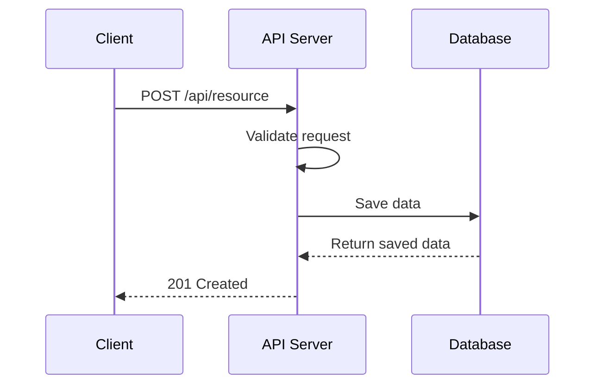

# [모듈명] 기능 명세서

## 개요

### 목적
[이 기능의 목적과 비즈니스 가치를 기술합니다]

### 범위
[이 명세서가 다루는 범위와 다루지 않는 범위를 명시합니다]

### 관련 문서
- [관련 명세서 링크]
- [외부 참조 문서]

---

## 용어 정의

| 용어 | 정의 |
|-----|------|
| 용어1 | 정의1 |
| 용어2 | 정의2 |

---

## 기능 요구사항

### FR-001: [기능 요구사항 제목]
- **설명**: [상세 설명]
- **우선순위**: High / Medium / Low
- **수용 기준**:
  - [ ] 기준 1
  - [ ] 기준 2

### FR-002: [기능 요구사항 제목]
- **설명**: [상세 설명]
- **우선순위**: High / Medium / Low
- **수용 기준**:
  - [ ] 기준 1

---

## API 엔드포인트

### METHOD /api/path

#### 설명
[엔드포인트 설명]

#### 요청

**Headers:**
| 헤더 | 필수 | 설명 |
|-----|-----|------|
| Authorization | Y | Bearer token |
| Content-Type | Y | application/json |

**Request Body:**
```json
{
  "field1": "string (필수) - 설명",
  "field2": "number (선택) - 설명"
}
```

**Query Parameters:**
| 파라미터 | 타입 | 필수 | 설명 |
|---------|-----|-----|------|
| param1 | string | N | 설명 |

#### 응답

**성공 (200 OK):**
```json
{
  "id": 1,
  "field1": "value",
  "createdAt": "2024-01-15T10:00:00Z"
}
```

**에러 응답:**
| 코드 | 에러 코드 | 설명 |
|-----|---------|------|
| 400 | ERR_INVALID_REQUEST | 잘못된 요청 |
| 401 | ERR_UNAUTHORIZED | 인증 필요 |
| 404 | ERR_NOT_FOUND | 리소스 없음 |
| 500 | ERR_INTERNAL | 서버 에러 |

---

## 데이터 모델

### EntityName

| 필드 | 타입 | 필수 | 설명 |
|-----|------|-----|------|
| id | Long | Y | 고유 식별자 (PK) |
| field1 | String | Y | 설명 |
| field2 | Integer | N | 설명 |
| status | Enum | Y | 상태 (ACTIVE, INACTIVE) |
| createdAt | DateTime | Y | 생성일시 |
| updatedAt | DateTime | Y | 수정일시 |

**관계:**
- EntityName (1) --- (*) RelatedEntity

---

## 비즈니스 규칙

### BR-001: [규칙 제목]
- **설명**: [규칙 상세 설명]
- **조건**: [규칙이 적용되는 조건]
- **결과**: [규칙 적용 시 결과]

### BR-002: [규칙 제목]
- **설명**: [규칙 상세 설명]
- **조건**: [규칙이 적용되는 조건]
- **결과**: [규칙 적용 시 결과]

---

## 시퀀스 다이어그램



---

## 에러 처리

### ERR_INVALID_REQUEST
- **원인**: [에러 발생 원인]
- **해결**: [사용자/개발자 조치 사항]

### ERR_NOT_FOUND
- **원인**: [에러 발생 원인]
- **해결**: [사용자/개발자 조치 사항]

---

## 보안 고려사항

- [ ] 인증/인가 검증
- [ ] 입력값 검증 (XSS, SQL Injection 방지)
- [ ] 민감 데이터 마스킹
- [ ] Rate Limiting

---

## 테스트 케이스

### TC-001: [테스트 케이스 제목]
- **전제 조건**: [테스트 전 상태]
- **테스트 단계**:
  1. 단계 1
  2. 단계 2
- **예상 결과**: [기대하는 결과]

---

## 변경 이력

| 버전 | 날짜 | 작성자 | 변경 내용 |
|-----|------|-------|---------|
| 1.0.0 | YYYY-MM-DD | 작성자 | 최초 작성 |
